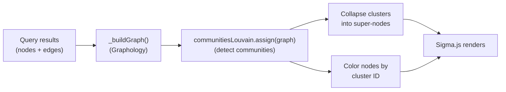
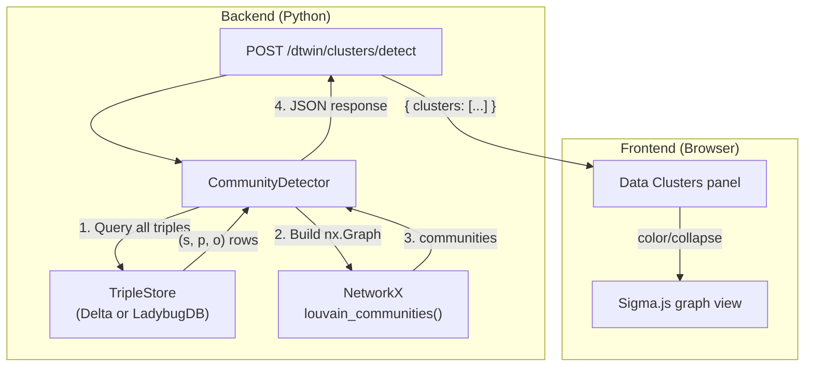

# Data Cluster Detection on the Knowledge Graph

## Context: Groups vs. Clusters

Today, **groups** are a design-time concept: you manually assign ontology classes to named groups, and the Sigma view can collapse instances of those classes into super-nodes using union-find connected components. This is **schema-driven** -- it knows nothing about how the actual data is connected.

**Data clusters** would be the opposite: automatically detected communities of densely-connected entities in the actual knowledge graph data, regardless of their ontology class. Two `Person` nodes and three `Organization` nodes that happen to be heavily inter-linked would form a single cluster.

## Approach: Two Phases

### Phase 1 -- Frontend Louvain (primary deliverable)

The `graphology-library@0.8.0` bundle already loaded in [`query-sigmagraph.js`](src/front/static/query/js/query-sigmagraph.js) (line 71) includes `graphologyLibrary.communitiesLouvain`. This means we can run community detection **client-side on the currently loaded graph** with zero new dependencies.

**How it works:**



**Key implementation points:**

- **Detection**: Call `graphologyLibrary.communitiesLouvain.assign(graph, { nodeCommunityAttribute: '_cluster' })` on the undirected projection of the Graphology graph. This writes a `_cluster` integer attribute on each node.
- **Visualization mode -- color by cluster**: A new toggle "Color by cluster" recolors nodes by their `_cluster` value instead of by entity type. A generated palette assigns distinct colors per community.
- **Visualization mode -- collapse clusters**: Reuse the existing union-find/super-node pattern from group collapse. Instead of grouping by ontology class membership, group by `_cluster` value. Each community becomes a collapsible super-node labeled "Cluster #N (X entities)".
- **Resolution parameter**: Expose a slider/dropdown so the user can control granularity. Louvain's `resolution` parameter (default 1.0) determines how many clusters emerge -- higher = more clusters, lower = fewer.
- **UI location**: New "Data Clusters" accordion section in the Sigma sidebar, below the existing "Groups" section. Contains: "Detect Clusters" button, resolution control, cluster list with member counts, collapse/expand toggles, and a "Color by cluster" checkbox.

**Files to modify:**

- [`src/front/static/query/js/query-sigmagraph.js`](src/front/static/query/js/query-sigmagraph.js) -- Add cluster detection logic, a cluster coloring mode, and cluster-based collapse (mirroring group collapse).
- [`src/front/static/query/css/query-sigmagraph.css`](src/front/static/query/css/query-sigmagraph.css) -- Styles for the cluster panel and controls.
- [`src/front/templates/partials/dtwin/_query_sigmagraph.html`](src/front/templates/partials/dtwin/_query_sigmagraph.html) -- Add the "Data Clusters" UI section in the sidebar.

**No backend changes, no new dependencies.**

### Phase 2 -- Backend community detection with NetworkX

For large knowledge graphs where only a fraction of data is loaded in the browser, frontend Louvain is limited to visible nodes. A backend approach runs community detection on the **full triplestore** and sends cluster assignments to the frontend.

#### Why NetworkX

- **100% pure Python**: No C compiler, no shared libraries, no platform-specific wheels. Installs cleanly on macOS, Linux, and inside Databricks Apps containers.
- **Built-in Louvain** (since v3.0): `networkx.community.louvain_communities(G)` -- no extra package needed.
- **Multiple algorithms included**: Louvain, Label Propagation, greedy modularity, Girvan-Newman, k-clique, Kernighan-Lin -- all available from a single dependency.
- **Performance**: Handles 10K-node graphs in seconds, 50K-node graphs in tens of seconds. Sufficient for typical OntoBricks knowledge graphs.
- **Single new dependency**: One new line in `pyproject.toml`: `"networkx>=3.0"`. Not currently in the project's dependency tree.

#### Architecture



#### Implementation details

**New files:**

- [`src/back/core/graph_analysis/__init__.py`](src/back/core/graph_analysis/__init__.py) -- Package init, re-exports `CommunityDetector`.
- [`src/back/core/graph_analysis/CommunityDetector.py`](src/back/core/graph_analysis/CommunityDetector.py) -- Service class that:
  1. Accepts a triplestore backend instance.
  2. Queries all triples (or a filtered subset by predicate/class).
  3. Builds a `networkx.Graph` (undirected) where nodes are subjects/objects and edges are predicates.
  4. Runs the selected algorithm (`louvain`, `label_propagation`, `greedy_modularity`).
  5. Returns a list of `ClusterResult` objects: `{ id, algorithm, members: [uri, ...], size, modularity }`.
- [`src/back/core/graph_analysis/models.py`](src/back/core/graph_analysis/models.py) -- Dataclasses: `ClusterResult`, `ClusterRequest` (algorithm, resolution, filters).

**Modified files:**

- [`pyproject.toml`](pyproject.toml) -- Add `"networkx>=3.0"` to `dependencies`.
- [`src/api/routers/internal/dtwin.py`](src/api/routers/internal/dtwin.py) -- Add endpoint:
  - `POST /dtwin/clusters/detect` -- accepts `{ algorithm, resolution, predicateFilter?, classFilter? }`, returns `{ clusters: [...], stats: { nodeCount, edgeCount, modularity, elapsed } }`.
- [`src/back/objects/digitaltwin/digitaltwin.py`](src/back/objects/digitaltwin/digitaltwin.py) -- Add `detect_clusters()` method that wires the triplestore to `CommunityDetector`.
- [`src/front/static/query/js/query-sigmagraph.js`](src/front/static/query/js/query-sigmagraph.js) -- Frontend calls the backend endpoint when the user clicks "Detect Clusters (full graph)" and uses the returned cluster assignments for coloring/collapse.

**API contract:**

Request:
```json
{
  "algorithm": "louvain",
  "resolution": 1.0,
  "predicate_filter": null,
  "class_filter": null,
  "max_triples": 500000
}
```

Response:
```json
{
  "clusters": [
    { "id": 0, "members": ["http://ex.org/Person/1", "http://ex.org/Org/42", "..."], "size": 23 },
    { "id": 1, "members": ["..."], "size": 17 }
  ],
  "stats": {
    "node_count": 4521,
    "edge_count": 12034,
    "cluster_count": 8,
    "modularity": 0.62,
    "algorithm": "louvain",
    "elapsed_ms": 1230
  }
}
```

**Safety guardrails:**

- `max_triples` parameter caps the number of triples loaded into memory (default 500K). If the triplestore exceeds this, the endpoint returns an error suggesting frontend-only detection or a filter.
- The endpoint runs as a background task (via `TaskManager`) for large graphs, so it doesn't block the request.
- A predicate filter allows excluding high-cardinality predicates (e.g., `rdfs:label`, `rdf:type`) that would create noise in the community structure.

#### Available algorithms (all built into NetworkX)

- **Louvain** (`networkx.community.louvain_communities`) -- Fast modularity optimization; configurable `resolution` parameter. Best general-purpose choice.
- **Label Propagation** (`networkx.community.label_propagation_communities`) -- Near-linear time, non-deterministic. Good for very fast approximate clustering.
- **Greedy Modularity** (`networkx.community.greedy_modularity_communities`) -- Agglomerative approach. Can specify a target number of communities via `cutoff`.
- **Girvan-Newman** (`networkx.community.girvan_newman`) -- Divisive (edge-betweenness removal). Slowest but produces a hierarchy. Not recommended for large graphs.

The UI will offer Louvain and Label Propagation as the primary choices, with greedy modularity as an advanced option.

#### When to use frontend vs. backend

- **Exploring a query result** (< few thousand nodes): **Frontend** Louvain -- instant, no server round-trip.
- **Analyzing the full knowledge graph** (thousands to tens of thousands of nodes): **Backend** NetworkX -- sees entire graph, not just loaded portion.
- **Very large knowledge graphs** (> 100K nodes): **Backend** with `class_filter` / `predicate_filter` to partition the analysis scope.

## Design Decisions

- **Undirected projection**: Louvain operates on undirected graphs. The Graphology graph is directed (edges have source/target), so we create an undirected copy for detection, then map results back. `graphologyLibrary.communitiesLouvain` handles this natively via its `getEdgeWeight` option. On the backend, `networkx.Graph` (undirected) is used directly.
- **Coexistence with groups**: Clusters and groups are independent. A user can have ontology groups active AND data clusters detected simultaneously. The UI should make the distinction clear ("Design Groups" vs "Data Clusters").
- **No persistence**: Detected clusters are transient -- they exist only for the current visualization session. They are not saved to the domain session. This is intentional: clusters change when the data changes.
- **Edge weight**: By default all edges have weight 1. A future enhancement could weight edges by predicate frequency or importance.
- **Predicate filtering**: Not all predicates contribute equally to meaningful clusters. `rdf:type` and `rdfs:label` connect most nodes and create noise. The backend and potentially the frontend should allow excluding specific predicates from the clustering graph.
