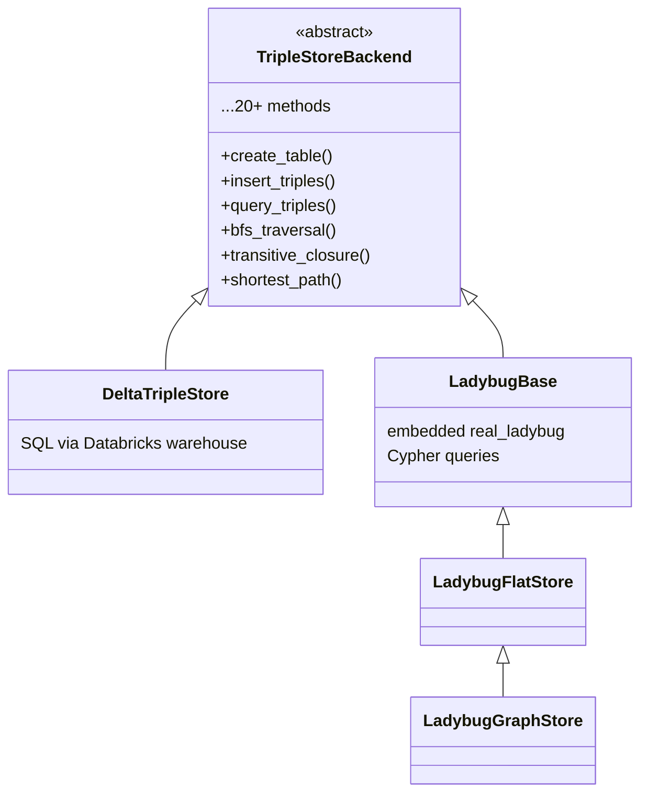

# FalkorDB as Alternative Graph Backend for OntoBricks

## Current Architecture

The triple-store layer follows a **Strategy pattern**:



[`TripleStoreFactory.py`](src/back/core/triplestore/TripleStoreFactory.py) dispatches on `backend`: `"view"` -> Delta, `"graph"` -> Ladybug. A new `"falkor"` key will select FalkorDB.

## Key Differences: LadybugDB vs FalkorDB

| Aspect | LadybugDB (`real_ladybug`) | FalkorDB |
|--------|---------------------------|----------|
| Deployment | **Embedded** file (`.lbug` on local disk) | **Client/server** (Redis protocol, host:port) |
| Cypher dialect | Kuzu-based (`CREATE NODE TABLE`, `INT64 PRIMARY KEY`) | Standard OpenCypher (label-based, no DDL for tables) |
| Multi-graph | One DB file per domain version | `client.select_graph("name")` on same server |
| Persistence | Local file + tar.gz sync to UC Volumes | Server-managed (RDB/AOF, cloud backup) |
| Python client | `real_ladybug` (embedded C++ bindings) | `falkordb` (Redis-based, sync + async) |

## Migration Friction Points

**5 `isinstance(LadybugBase)` checks** in the reasoning layer gate Cypher-vs-SQL code paths:
- [`SWRLEngine.py:214`](src/back/core/reasoning/SWRLEngine.py) -- selects Cypher translator
- [`SPARQLRuleEngine.py:361`](src/back/core/reasoning/SPARQLRuleEngine.py) -- Cypher rule compilation
- [`AggregateRuleEngine.py:316`](src/back/core/reasoning/AggregateRuleEngine.py) -- Cypher aggregates
- [`DecisionTableEngine.py:359`](src/back/core/reasoning/DecisionTableEngine.py) -- Cypher decision tables
- [`ReasoningService.py:268`](src/back/core/reasoning/ReasoningService.py) -- checks if reasoning is possible

These must be refactored so FalkorDB (also Cypher-based) is recognized as a Cypher-capable backend.

## Implementation Plan

### Phase 1: Introduce `CypherCapable` protocol (refactor prerequisite)

Add a lightweight marker mixin/protocol to [`TripleStoreBackend.py`](src/back/core/triplestore/TripleStoreBackend.py):

```python
class CypherCapable:
    """Marker mixin for backends that support Cypher queries."""
    def execute_cypher(self, query: str, parameters: dict = None) -> list:
        raise NotImplementedError
```

- Make `LadybugBase` inherit from both `TripleStoreBackend` and `CypherCapable`
- Refactor the 5 `isinstance(LadybugBase)` checks to `isinstance(store, CypherCapable)`
- This is a **zero-behavior-change** refactoring step

### Phase 2: Create `falkordb/` backend subpackage

New directory: `src/back/core/triplestore/falkordb/` following the same structure as `ladybugdb/`:

- **`FalkorBase.py`** -- `FalkorBase(TripleStoreBackend, CypherCapable)`: connection to FalkorDB server via `falkordb` Python client, `execute_cypher()` implementation, graph selection
- **`FalkorFlatStore.py`** -- flat triple model (single node label `Triple` with `subject`, `predicate`, `object` properties), all CRUD in OpenCypher
- **`FalkorGraphStore.py`** -- ontology-typed model (OWL classes as node labels, object properties as relationship types), mirroring `LadybugGraphStore` logic but with standard OpenCypher DDL
- **`models.py`** -- reuse or adapt `NodeTableDef` / `RelTableDef` with `to_cypher()` producing FalkorDB-compatible Cypher
- **`__init__.py`** -- re-exports

Key Cypher differences to handle:
- **No `CREATE NODE TABLE`**: FalkorDB uses labels implicitly; schema enforcement via indexes
- **No `INT64 PRIMARY KEY`**: use a `uri` property with a unique index instead
- **Parameters**: FalkorDB uses `$param` syntax (same as Ladybug, should port cleanly)
- **Path queries**: FalkorDB supports `shortestPath()` natively (simpler than Ladybug's `SHORTEST 1..n` syntax)

### Phase 3: Wire into `TripleStoreFactory`

Extend [`TripleStoreFactory.py`](src/back/core/triplestore/TripleStoreFactory.py):
- Add `"falkor"` backend key in `create()`
- New `_create_falkor()` method reading config: `host`, `port`, `password`, `graph_name` from domain session or settings
- Set `FALKOR_AVAILABLE` class flag (same pattern as `LADYBUG_AVAILABLE`)

### Phase 4: Adapt SWRL/reasoning Cypher translators

The existing `SWRLCypherTranslator` and `SWRLFlatCypherTranslator` generate Kuzu-flavored Cypher. Two options:

- **Option A (recommended):** Keep existing translators as-is for Ladybug; create `SWRLFalkorCypherTranslator` that generates standard OpenCypher. The `SWRLEngine` selects based on `isinstance(FalkorBase)` vs `isinstance(LadybugBase)` (both are `CypherCapable`).
- **Option B:** Unify into a single translator with a `dialect` parameter. More elegant long-term but higher risk of regressions.

### Phase 5: Configuration and settings

- Add FalkorDB connection settings to [`shared/config/settings.py`](src/shared/config/settings.py) (env vars: `FALKOR_HOST`, `FALKOR_PORT`, `FALKOR_PASSWORD`)
- Update the settings UI to allow selecting `"falkor"` as the backend
- No UC Volume sync needed -- FalkorDB manages its own persistence server-side

### Phase 6: Adapt sync story

LadybugDB has `GraphSyncService` for tar.gz backup/restore to UC Volumes. FalkorDB does **not** need this (it's server-managed). However:
- The `auto_restore` callback pattern in the factory can be skipped for Falkor
- Domain version isolation is handled by `client.select_graph("domain_V1")` instead of separate files

## Dependency

Add to `pyproject.toml`:
```
falkordb>=1.0.0
```

FalkorDB requires a running FalkorDB server (Docker: `docker run -p 6379:6379 falkordb/falkordb`).

## What Does NOT Change

- `DeltaTripleStore` (SQL backend) -- untouched
- `LadybugDB` backends -- remain fully functional, still the default
- OWL/RDFS/SHACL parsers and generators -- operate on RDFLib, unrelated to storage
- GraphQL schema builder -- consumes `TripleStoreBackend` interface, backend-agnostic
- Frontend templates and JS -- backend-transparent (except settings dropdowns)

## Risk Assessment

- **Cypher dialect gap**: The biggest risk. LadybugDB uses Kuzu-style Cypher extensions (`CREATE NODE TABLE`, `acyclic` keyword, `SHORTEST 1..n`). FalkorDB uses standard OpenCypher with its own extensions. Each query method needs testing.
- **Network dependency**: FalkorDB adds a network hop (latency, failure modes) vs embedded Ladybug. Need connection pooling and retry logic in `FalkorBase`.
- **Multi-tenancy**: FalkorDB supports 10K+ multi-graphs natively -- actually a strength for OntoBricks' per-domain-version model.
